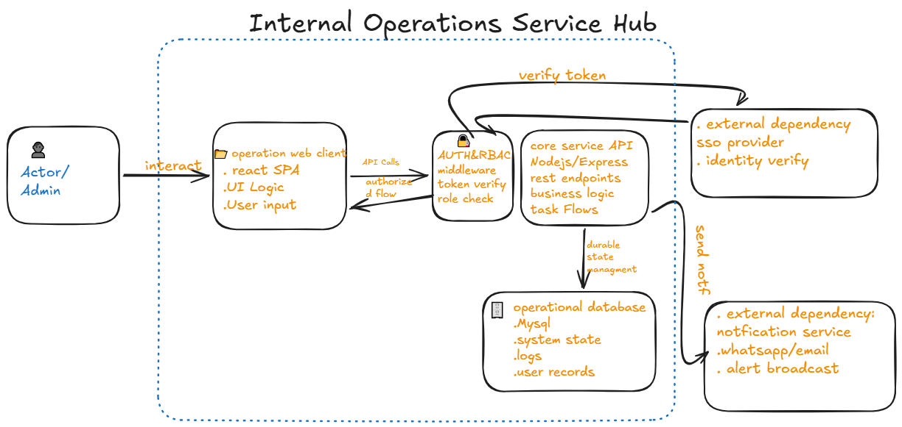

# Architecture Draft: Internal Operations Service Hub

# 1. System Overview & Major Components

The Internal Operations Service Hub acts as a centralized portal for internal staff to manage operational workflows, submit internal service requests, and track administrative tasks across departments.

* *Operations Web Client:** React-based single-page web interface used by internal employees and administrators to interact with the hub.
* *Core Service API:** Node.js / Express REST API handling business logic, request routing, task state transitions, and role checks.
* *Operational Database:** MySQL relational database managing durable application state, including user records, audit logs, and service ticket statuses.

# 2. System Boundaries & Dependencies
* *Inside System Boundary:** Operations Web Client, Core Service API, Operational Database, internal authorization rules.
* *External Dependencies:*
  * *Identity Provider (SSO / OAuth 2.0):** External company authentication service used to verify employee identity before issuing local session tokens.
  * *Notification Service (WhatsApp / Email Gateway):** Third-party messaging provider used to broadcast task updates and status alerts to staff.

# 3. Data Flow & Security Checkpoints
1. *Request Initiation:** An internal user submits an operational request or status update through the Web Client.
2. *Authentication Guard:** The Core Service API intercepts the request, verifying the session token issued by the SSO provider.
3. *Authorization & RBAC:** The API verifies if the user's role (e.g., *Manager*, *Operator*, *Admin*) permits updating or reading the requested operation state.
4. **State Persistence:** The API executes authorized business logic and writes state changes directly to the Operational Database.
5. **Notification Dispatch:** The API triggers an asynchronous alert job to the Notification Service to inform relevant actors.

# 4. Failure Handling & Requirement Traceability
* *Notification Service Failure:** If the external messaging gateway is unreachable, the API logs the dispatch error and queues the alert for retry in the database without failing the primary operational transaction.
* *Database Disconnection:** The Core Service API rejects incoming requests with a `503 Service Unavailable` status and initiates automatic connection pool recovery instead of terminating the process.
* *Traceability to Spec:*
  * Requirement: Strict operational access controls. -> Handled via central Express authorization middleware.
  * Requirement: *Auditability of internal actions.* -> Handled via transactional writes to the audit log table in MySQL.